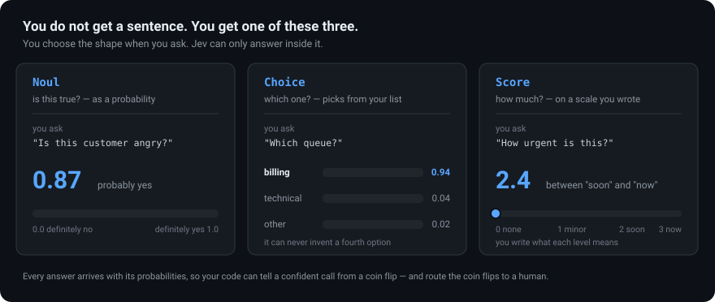
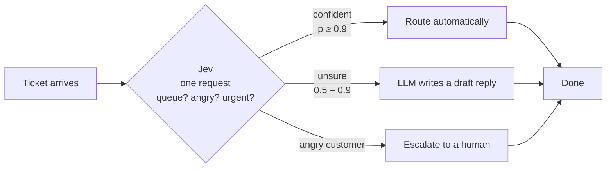

<h1 align="center">play-with-jev</h1>

<p align="center">
  <strong>A beginner's guide to Jev — and a small project to learn it with.</strong>
</p>

<p align="center">
  Jev is a new kind of AI model from <a href="https://typesafe.ai">TypeSafe AI</a>.<br/>
  It does not write sentences. It makes up its mind.
</p>

---

## Start here: the one-sentence version

> A normal AI model **writes you an answer**, word by word.
> Jev **picks one of the answers you gave it**, all at once, and tells you how sure it is.

That is the whole idea. Everything below is just detail.



Watch the top row: the LLM builds `{"category": "billing"}` one piece at a time, and **each piece has
to go back into the model before the next one can be written**. That's called being
*autoregressive*, and it's why chatbots type at you instead of blinking the answer into existence.

Now the bottom row. Jev was handed three possible answers — `billing`, `technical`, `other` — and it
points at one. There's no sentence to write, so there's nothing to write one piece at a time.

---

## Wait, why is it called "System One"?

This is a reference to psychologist Daniel Kahneman's *Thinking, Fast and Slow*, which splits human
thinking into two modes:

| | What it is | Human example | AI example |
|---|---|---|---|
| **System 1** | Fast, automatic, no effort. You just *know*. | Reading the word "STOP". Seeing a face is angry. | **Jev** |
| **System 2** | Slow, deliberate, effortful. You work it out. | Multiplying 17 × 24. Planning a trip. | **GPT-style LLMs, especially with "reasoning"** |

Most AI products today use a System 2 model for *everything* — including the hundreds of tiny System 1
judgments an app makes. "Is this spam?" "Which team gets this ticket?" "Is this reply rude?"

Those are snap judgments. You don't need an essayist for them. That's the gap Jev is built for.

> **TypeSafe calls this class of model a "System One model."** Jev is their first one, and it launched
> on 15 September 2026. Their pitch: for these small decisions it's roughly **40–200× faster and
> 40–400× cheaper** than a frontier LLM. *(Those are the vendor's published numbers — worth measuring
> on your own data before you bet on them.)*

---

## What you actually get back

With a chatbot you get text, and text can be anything. With Jev, **you pick the shape of the answer
before you ask**, and the answer can only come back in that shape.

There are exactly three shapes. TypeSafe calls them **primitives**.



Plain English:

- **Noul** — *"Is this true?"* You get a number from 0 to 1. `0.87` means "pretty sure yes."
  (Odd name, simple idea. Think of it as a yes/no that's honest about doubt.)
- **Choice** — *"Which one of these?"* You hand it a list of labels. It picks one and scores all of them.
- **Score** — *"How much?"* You write out what each level on a scale means. It places the answer,
  and it can land between levels — `2.4` means "mostly a 2, leaning 3."

The important part: **you write the options.** Jev cannot answer outside them.

---

## Why that matters more than it sounds

Here's the same job done both ways. Watch the left box — it changes every couple of seconds, because
that's what "the model writes you some text" actually means in production.



Anyone who has shipped an LLM feature knows the left-hand column: the model says "Sure! Here's the
JSON:" and your parser dies, or it returns `"billing_issue"` when your database only accepts
`"billing"`.

**In fairness:** modern LLM APIs have JSON mode and structured outputs, and those fix most of this.
So don't pick Jev *just* for the shape. Pick it because the decision is the entire output and it
arrives in one pass — with a probability attached.

---

## Show me the code

**The way you'd do it with an LLM** — prompt, hope, parse, validate, retry:

```python
prompt = f"""Classify this ticket as billing, technical, or other.
Reply with only JSON: {{"category": "..."}}

Ticket: {ticket}"""

text = llm.generate(prompt)          # a string. could be anything.
text = strip_markdown_fences(text)   # because sometimes it adds ```json
data = json.loads(text)              # may raise
category = data["category"]          # may be a key that isn't there
if category not in {"billing", "technical", "other"}:
    ...                              # may be a label you never offered
```

**The way you do it with Jev** — say what you want, read the answer:

```python
from typesafe_sdk import Choice, Noul, TypeSafeClient

with TypeSafeClient() as client:                       # reads TYPESAFE_API_KEY
    result = client.system_one(
        state={"ticket": "I was charged twice. Please fix this ASAP."},
        questions={
            "queue": Choice(
                instructions="Which team should handle this ticket?",
                criteria={
                    "billing": "Money: charges, refunds, invoices, payment methods.",
                    "technical": "The product is broken, erroring, or not loading.",
                    "other": "Anything that is neither of the above.",
                },
            ),
            "angry": Noul(instructions="Is the customer upset?"),
        },
    )

result.choices["queue"].choice        # "billing"
result.choices["queue"].confidence    # 0.94
result.nouls["angry"].noul            # 0.87
```

Two things worth noticing:

1. **Both questions went in one request.** Independent questions about the same text run together and
   cost you one round trip. They can't see each other's answers, which is fine — they're independent.
2. **`criteria` is where the real work is.** That's you explaining what each label means. Vague
   criteria produce vague judgments; this is the part to iterate on.

---

## Where it sits in an app

Jev is not a replacement for your LLM. It's the thing that decides *whether you need one*.



Code owns the workflow — the thresholds, the routing, the escalation rules. Jev supplies the judgment
in the middle that plain code can't make. That's the pattern: **keep the rules in code, put the
common sense in Jev.**

---

## When to use which

| Use **Jev** when… | Use an **LLM** when… |
|---|---|
| The answer is one of a known set | The answer is prose a human will read |
| You're doing it thousands of times | You're doing it occasionally |
| Latency is in the user's way | The user expects to wait |
| You want a probability to threshold on | You want an explanation |
| Routing, filtering, ranking, triage, guardrails | Writing, summarising, chatting, coding |

Plenty of real systems use both: Jev decides, and the LLM only gets woken up for the cases that
actually need words.

---

## Three things beginners get wrong

**1. "Typed means correct."** No. Typed means the answer will *always* be one of your labels — it
guarantees the **shape**, not the **truth**. Jev can be confidently wrong, same as anything else. Test
it on your own data.

**2. "A noul of 0.5 means medium."** No. A noul is *the probability the answer is yes*. `0.5` means
Jev genuinely can't tell — a coin flip. If you asked "is this urgent?", `0.5` does not mean
"moderately urgent"; it means "no idea." For intensity, use a **Score**.

**3. "Low confidence means it's broken."** Not necessarily. If two of your labels are both reasonable,
probability splits between them — that's the model being honest. On a harmless choice, low confidence
may not matter at all. On a refund, it should route to a human.

---

## Try it yourself

```bash
pip install typesafe-sdk
export TYPESAFE_API_KEY=...        # from typesafe.ai — currently early access
```

```python
from typesafe_sdk import Noul, TypeSafeClient

with TypeSafeClient() as client:
    r = client.system_one(
        state="the wifi on this train is held together with hope",
        questions={"complaint": Noul(instructions="Is this a complaint?")},
    )
print(r.nouls["complaint"].noul)
```

The default model is `jev-latest`. Requests go to `POST https://api.typesafe.ai/v1/systemone`.
There's an official JavaScript SDK too (`@typesafe-ai/sdk`), and Jev is reachable through OpenRouter,
the Vercel AI Gateway, Pydantic AI, and LiteLLM.

---

## Glossary

| Term | Meaning |
|---|---|
| **Autoregressive** | Writes output one token at a time, each one depending on the last. How normal LLMs work. |
| **Token** | A chunk of text — roughly a short word or part of one. The unit LLMs generate in. |
| **System One model** | A model that returns a fast, typed decision instead of text. Jev is one. |
| **Primitive** | One of Jev's three question shapes: Noul, Choice, Score. |
| **State** | The data you give Jev to judge — the ticket, the post, the document. |
| **Criteria** | Your descriptions of what each possible answer means. |
| **Calibrated** | When a model says 0.9, it's right about 90% of the time. What makes probabilities usable. |

---

## What's in this repo

| Path | What it is |
|---|---|
| `src/jevscan/` | A working example: finds posts about Jev in an X account, using Jev to judge them |
| `docs/jevscan.md` | How that example works and how to run it |
| `docs/*.svg` | The diagrams above, hand-written and animated |

The example is deliberately small and exists to be read. It shows the pattern this whole README is
about: code does the fetching and the thresholds, Jev makes the one judgment code can't — telling
posts about *this* Jev apart from posts about the rapper, the YouTuber, and everyone else named Jev.

---

<div align="center">
<sub>Not affiliated with TypeSafe AI. Built to learn with.</sub>
</div>
